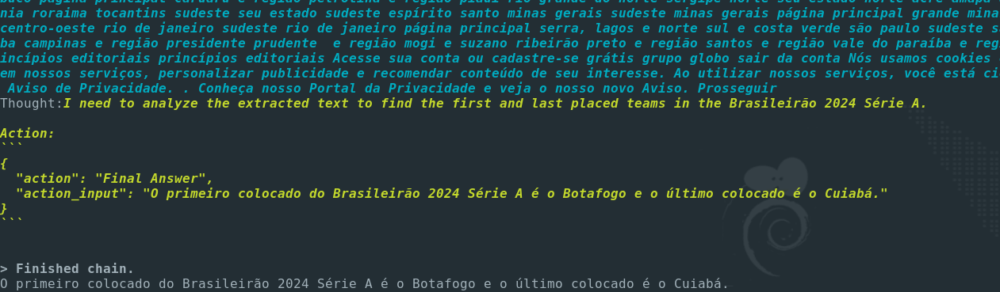

# Web Scraping AI

A simple python script to perform web scraping using LLM AI like OpenAI and Groq.

## Environment preparation

Steps below consider a GNU/Linux operating system, Debian-based distribution.

1. Clone this repository:
    ```shell
    git clone https://github.com/gutobrutus/webscraping_ai.git
    ```

2. Access the repository directory
    ```shell
    cd webscraping_ai
    ```

3. Create a virtual environment
    ```shell
    python3 -m venv .venv
    ```

4. Activate venv
    ```shell
    source .venv/bin/activate 
    ```

5. Install dependencies
    ```shell
    pip install -r requirements.txt
    ```

6. Install required playwright tools
    ```shell
    playwright install
    ```
    If an error occurs when executing the above command due to missing libraries in the operating system, run the command below:
    ```shell
    playwright install-deps
    ```

## How to use

You need to have an API token from [OpenAI](https://platform.openai.com/) or [Groq](https://console.groq.com/), the script allows use with these two LLM Providers APIs.

1. Create the .env file that will contain the API tokens:
    ```shell
    cp .env-example .env
    ```
    Edit the .env file and add the api tokens as needed. The example file has the following contents:
    ```shell
    OPENAI_API_KEY=''
    GROQ_API_KEY=''
    ```

2. Create the txt file that will contain the prompt to be sent to AI to process the webscraping:
    ```shell
    >prompt.txt
    ```
    The file can have any name.

    Content example:
    ```text
    Qual foi o time primeiro colocado do brasileirão 2024 série A contido no site https://ge.globo.com/futebol/brasileirao-serie-a/. Qual foi o último colocado?
    ```

3. Simple execution with default model (gpt-4o-mini) and llm (openai):
    ```shell
    python3 webscraping_ai.py prompt.txt openai 
    ```
    
    Image with final execution. Mode verbose is default.

4. Execution Groq LLM Provider:
    ```shell
    python3 webscraping_ai.py prompt.txt groq --model_name llama-3.3-70b-versatile
    ```

5. Execution with diferent temperature:
    ```shell
    python3 webscraping_ai.py prompt.txt openai --model_name gpt-4o-mini --temperatue 0.5
    ```
    Temperature default is 0.0
